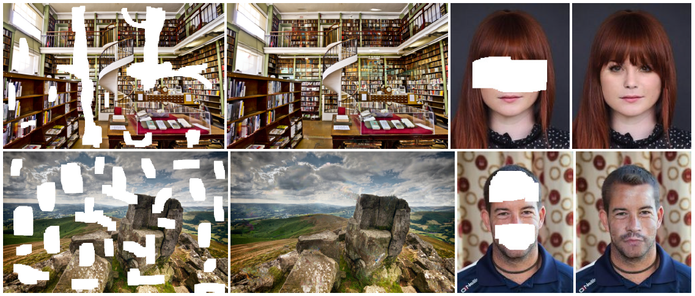
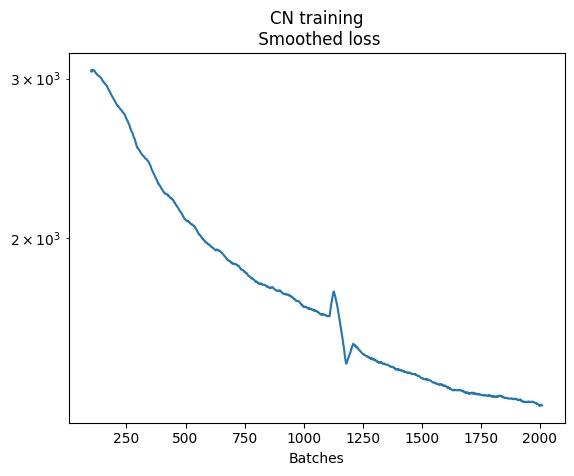

# Presentation

This project is based on the content of a computer vision course. I try to re-implement the following paper from 2017:
*Globally and Locally Consistent Image Completion*, http://dx.doi.org/10.1145/3072959.3073659



The project is developed using Git.
The implementation uses `torch` and CUDA for GPU training.
I use an ssh connection to a university machine with an NVIDIA GeForce RTX 3090 for the training sessions.

## Install

I created a python library called `glic` (*Globally and Locally consistent Image Completion*) to achieve this challenge.
One can install it with: `pip install -e .` from the root directory of the library (`-e` is useful if you aim to keep modifying the library).

## Discover

The best way to discover the library is to go through the notebooks.
Deep dive in the code for further documentation.

# *Completion Network*

I first built the image completion network, see ```lib/glic/networks/completion_network.py```.

The initial training can be remotely launched using ```nohup python train_cn.py``` (*make sure to initialize the `./logs/checkpoints/` and `./data/train/` directories*).

I trained the completion network for 19 hours on an NVIDIA GeForce RTX 3090.



The whole training would take an estimated time of 37 days.

To continue the project, I scrapped some weights from `https://github.com/satoshiiizuka/siggraph2017_inpainting` and adapted them to my network (the weights have to be converted from the torch format to the pytorch format).