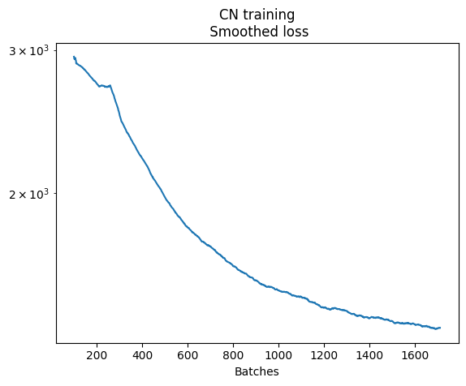
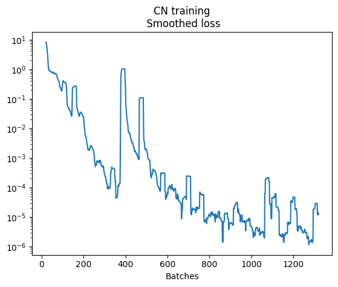
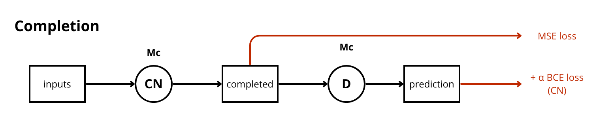

# Presentation

This project is based on the content of a computer vision MOOC from Ecole Polytechnique that I followed on my own. As a final project, I try to re-implement the following paper from 2017:
*Globally and Locally Consistent Image Completion*, http://dx.doi.org/10.1145/3072959.3073659

**Key takeaway:**
- I haven't been able to fully train the completion network due to limited computational power, so I started it with weights I found online. I handled the training of the discriminator and conjugate aspects myself.
- I reimplemented the following feature: *"In practice, we take a more fine-grained control, such as initially keeping the norm of the MSE loss gradient roughly the same order of magnitude as the norm of the discriminator gradient. This helps stabilize the learning."* which I have never seen in other reimplementations.

*The following demo was extracted from the paper:*


The project is developed using Git.
The implementation uses `torch` and CUDA for GPU training.
I use an ssh connection to a university machine with an NVIDIA GeForce RTX 3090 for the training sessions.

## Install

I created a python library called `glcic` (*Globally and Locally Consistent Image Completion*) to achieve this challenge.
One can install it with: `pip install -e .` from the root directory of the library (`-e` is useful if you aim to keep modifying the library).  
Use `pip install -r requirements.txt` from the root of the project for other libraries.
Two folders need to be manually created: `data/train` and `logs/checkpoints`.

## Discover

The best way to discover the library is to go through the notebooks.
Deep dive in the code for further documentation.

# Completion Network

I first built the image completion network, see ```lib/glic/networks/completion_network.py```.

Its trainer is ```lib/glic/trainers/cn_trainer.py```.

The initial training can be remotely launched using ```nohup python train_cn.py``` (*make sure to initialize the `./logs/checkpoints/` and `./data/train/` directories*).
  
I trained the completion network for 23 hours on an NVIDIA GeForce RTX 3090.



The first phase of the training would take an estimated time of 39 days.

To continue the project, I scrapped some weights from `https://github.com/otenim/GLCIC-PyTorch`.

After the weights transfer, the completion ability of the CN network was:


# Discriminator

The implementation of the discriminators is in ```lib/glic/networks/discriminators.py```.

Its trainer is ```lib/glic/trainers/discriminators_trainer.py```.

I trained the discriminator for 7 hours on an NVIDIA GeForce RTX 3090 and obtained:



When tested:


# Conjugate training

The conjugate training goes as follow:




**Warning:**
- BCE losses are different when considering the discriminator or the completion network: The discriminator tries to guess correctly, while the completion network tries to fool the discriminator.
- In the completion network case, one must ensure that the weights of the discriminator are not updated by the backward propagation of the BCE loss. The simplest way to implement this is to use two different optimizers.